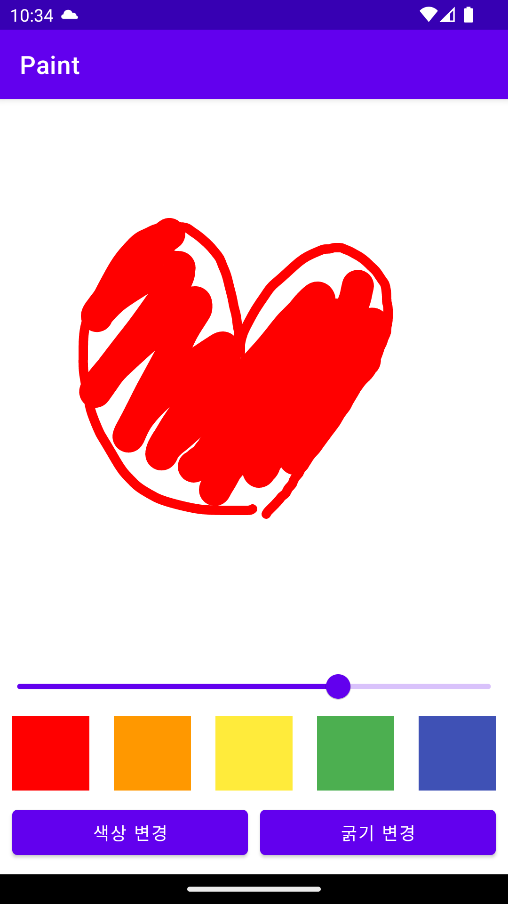

# android-paint

## step3 기능 요구사항

- [ ] 그림판 앱을 반응형으로 구현한다.
- [ ] 태블릿 디바이스의 세로(portrait)/가로(landscape)화면에서 어색해보이지 않도록 구현한다.
    - [ ] 구현 예시를 참고하여 태블릿 세로 화면에서는 도구 패널의 폭을 줄인다.
    - [ ] 구현 예시를 참고하여 태블릿 가로 화면에서는 도구 패널을 왼쪽 상단으로 옮긴다.
    - [ ] 만약 본인이 작성한 UI가 구현 예시를 참고하기 어려운 상태라면 융통성있게 구현한다.
- [ ] 다크모드를 대응한다.
    - [ ] 구현 예시를 참고하여 다크모드 전환 시 그림판 보드의 색상과 상태바 색상이 검은색으로 바뀌어야 한다.
    - [ ] 이외의 도구 패널 색상 등은 융통성있게 구현한다.

### step3 선택 요구사항

## step2 기능 요구사항

그림판 앱에 기능을 추가한다.

- [x] 화면에 사각형, 원 모양을 그릴 수 있도록 구현한다.
- [ ] 사용자가 자유롭게 크기나 위치를 조정할 수 있다. -> 올가미 기능을 말하는 건가?
- [x] 특정 영역의 요소를 지울 수 있는 지우개를 구현한다.
- [x] 브러쉬(펜, 사각형, 원, 지우개) 종류를 자유롭게 선택해서 그릴 수 있다.

### step2 선택 요구 사항

- [ ] 전체 그림을 지우는 기능을 추가한다.
- [ ] 취소(undo), 재실행(redo)을 구현한다.

## step1 기능 요구사항

그림판 앱을 구현한다.

- [x] 화면에 자유 곡선을 그릴 수 있다.
- [x]  도구 패널을 추가한다.
    - [x] 브러시 색상을 변경할 수 있다.
    - [x] 브러시 굵기를 변경할 수 있다.

## 구현 예시



## 힌트

### RangeSlider

브러시 굵기를 변경할 때에는 RangeSlider 컴포넌트를 활용할 수 있다.
RangeSlider 가 Value 를 들고 있게 할 수 있고 사용자는 최소값, 최대값 내 범위에서 선택할 수 있ㄷ.

```xml

<com.google.android.material.slider.RangeSlider android:id="@+id/range_slider" android:layout_width="match_parent"
    android:layout_height="wrap_content" android:visibility="gone" />
```

```kotlin
rangeSlider.valueFrom = 0.0f
rangeSlider.valueTo = 100.0f

rangeSlider.addOnChangeListener(RangeSlider.OnChangeListener { _, value, _ ->
    // value.toInt() 활용
})
```

### onTouchEvent

이전까지는 사용자의 터치 이벤트를 인식하기 위해 onClickListenr 를 구현해 사용했을 것이다.  
사용자의 터치 이벤트를 세분화해서 인식하기 위해 view 의 onTouchEvent 함수를 재정의할 수 있다.
화면에 손가락을 올리면 해당 터치 이벤트를 처리하기 위해 onTouchEvent() 콜백이 호출된다.
이벤트는 여러 번 실행되며 각 이벤트는 터치 위치, 압력, 크기 등을 포함한 세부 정보를 제공한다.
이 동작은 사용자가 손가락을 화면에서 떼면 종료된다.

```kotlin
override fun onTouchEvent(event: MotionEvent): Boolean {
    return when (event.action) {
        MotionEvent.ACTION_DOWN -> {
            Log.d(TAG, "ACTION_DOWN")
            true
        }
        MotionEvent.ACTION_MOVE -> {
            Log.d(TAG, "ACTION_MOVE")
            true
        }
        MotionEvent.ACTION_UP -> {
            Log.d(TAG, "ACTION_UP")
            true
        }
        else -> super.onTouchEvent(event)
    }
}
```

### invalidate() vs requestLayout()

뷰의 변화를 시스템에게 알리기 위한 두 방법이다.

* invalidate() 가 호출될 때는 draw 과정이 수행된다. 뷰의 속성이나 데이터가 변경되었을 때 사용한다.
* requestLayout() 이 호출될 때는 measure -> layout -> draw 단계를 다시 거치게 된다. 뷰의 크기나 위치, 혹은 부모 뷰의 크기나 레이아웃이 변경되었을 때 사용한다.
